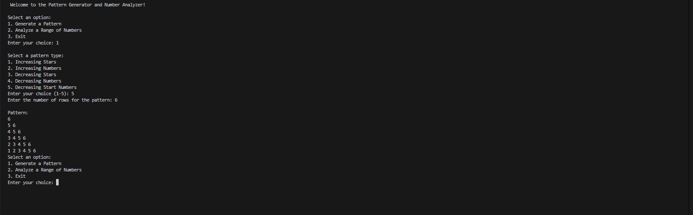
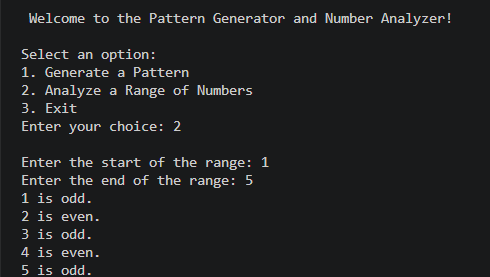

# Logic Box

## Output

### Pattern Genrator


### Number Analyzer


# Logic Box — Pattern Generator and Number Analyzer

A menu-driven Python console program built for PR.2. It offers two core
utilities in a single loop: a pattern generator (stars/number triangles) and
a number-range parity analyzer.

## Features

- **Pattern Generator** — 5 selectable patterns:
  1. Increasing Stars
  2. Increasing Numbers
  3. Decreasing Stars
  4. Decreasing Numbers
  5. Decreasing Start Numbers
- **Number Analyzer** — takes a start/end range and prints whether each
  number in the range is odd or even.
- **Menu-driven loop** — runs continuously until the user chooses to exit.
- Basic input validation on the pattern row count (rejects zero/negative
  values).

## Requirements

- Python 3.10+ (uses `match`/`case` statements)

## How to Run

```bash
python logic_box.py
```

## Usage

On launch, you'll see a menu:

```
1. Generate a Pattern
2. Analyze a Range of Numbers
3. Exit
```

**Option 1** then asks you to pick a pattern type (1–5) and a row count, and
prints the pattern.

**Option 2** asks for a start and end number, then prints `odd`/`even` for
every number in that (inclusive) range.

**Option 3** exits the program.

## Project Constraints

Written to curriculum scope for this assignment: only `while`/`for` loops,
`if`/`elif`/`else` and `match`/`case`, no function definitions (`def`) and
no exception handling (`try`/`except`).

## Tech Stack

- Python (standard library only, no external dependencies)

## File Structure

```
logic-box/
├── logic_box.py   # main program
└── README.md
```


# Logic Box - Pattern Generator and Number Analyzer

This is my PR.2 assignment. It's a simple menu based Python program that can do two things - generate number/star patterns and check if numbers in a range are odd or even.

## What it does

When you run it, you get a menu:
1. Generate a Pattern
2. Analyze a Range of Numbers
3. Exit

If you pick option 1, it'll ask which pattern you want (there are 5 of them - increasing stars, increasing numbers, decreasing stars, decreasing numbers, and one where the numbers decrease at the start of each row). Then it asks how many rows and prints it out.

Option 2 asks for a start and end number and tells you if each number in that range is odd or even.

Option 3 just exits.

The whole thing runs in a loop so you can keep using it until you choose exit.

## How to run

```
python logic_box.py
```

Needs Python 3.10 or above since I used match/case statements instead of a bunch of if-elif.

## Notes

This was for a class assignment so I had to stick to certain rules - no functions (def), no try/except, only loops and if/else or match/case. That's why some of the validation is a bit basic.

Pattern 5 was the tricky one to figure out, took me a few tries to get the loop logic right.

## Files

- logic_box.py - the actual program
- README.md - this file
